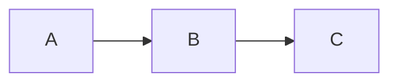
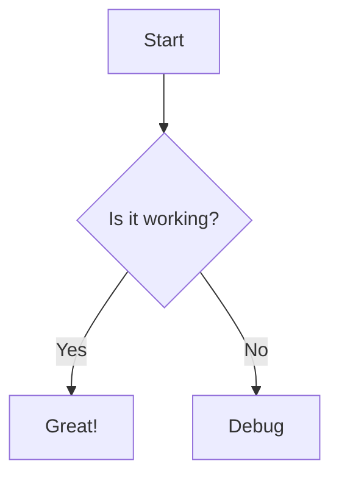
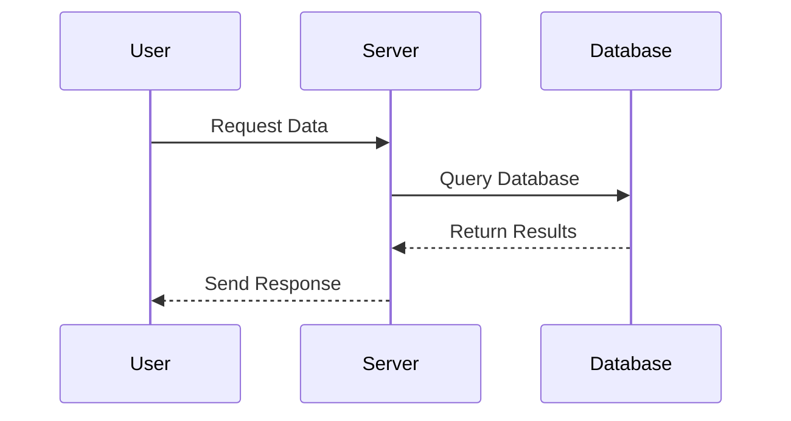
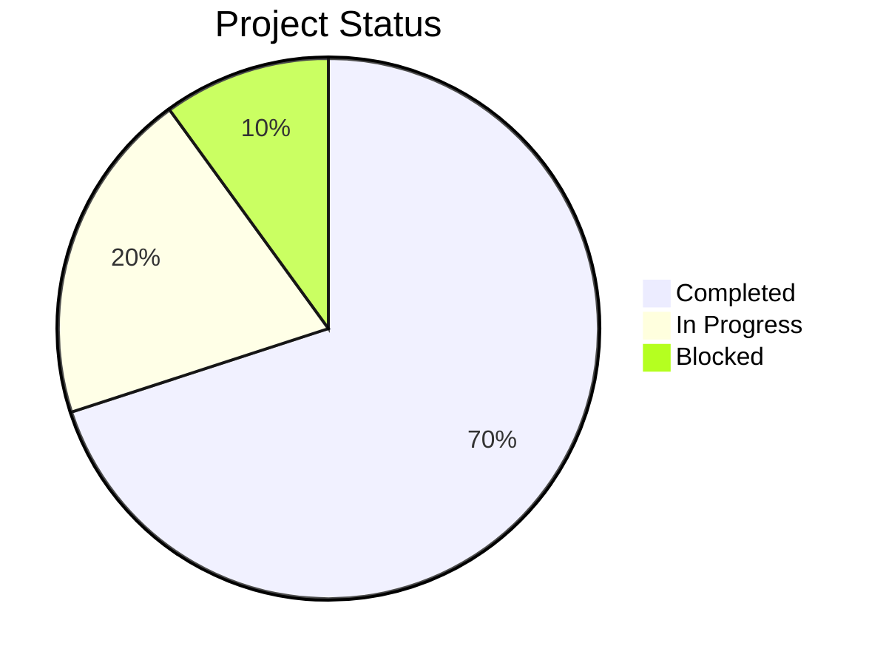

# Diagrams (Using Mermaid)

[1. Basic Syntax](#1-basic-syntax)    
[2. Flowcharts (Graphs)](#2-flowcharts-graphs)     
[3. Sequence Diagrams](#3-sequence-diagrams)     
[4. Class Diagrams](#4-class-diagrams)     
[5. Entity Relationship (ER) Diagram](#5-entity-relationship-er-diagrams)   
[6. Pie Charts](#6-pie-charts)     
[7. Configuration (Frontmatter)](#7-configuration-frontmatter)     

---

### 1. Basic Syntax

Diagrams are created using code blocks marked with the `mermaid` identifier.

**Syntax:**
````markdown
```mermaid
[Diagram Type]
    [Definitions]
```
````

**Example:**
````markdown

````

**Rendered:**


---

### 2. Flowcharts (Graphs)

Used for logic flows and processes. Start with `graph` or `flowchart` followed by the direction.

**Node Shapes:**
| Syntax     | Shape       |
| ---------- | ----------- |
| `[Text]`   | Rectangle   |
| `(Text)`   | Round edges |
| `([Text])` | Stadium     |
| `((Text))` | Circle      |
| `{Text}`   | Rhombus     |

**Directions:**
| Code | Direction    |
| ---- | ------------ |
| `TD` | Top → Down   |
| `BT` | Bottom → Top |
| `LR` | Left → Right |
| `RL` | Right → Left |

**Arrows:**
| Syntax        | Shape                        |
| ------------- | ---------------------------- |
| `---`         | Solid line                   |
| `-->`         | Solid arrow                  |
| `---\|text\|` | Solid line with text         |
| `-->\|text\|` | Solid arrow with text        |
| `-.->`        | Dotted line                  |
| `<-->`        | Multidirectional solid arrow |

**Example:**
````markdown

````

**Rendered:**


---

### 3. Sequence Diagrams

Used to show interactions over time between different participants. Sequence diagrams start with `sequenceDiagram`.

**Arrows:**
| Syntax   | Shape        |
| -------- | ------------ |
| `->`     | Solid line   |
| `-->`    | Dotted line  |
| `->>`    | Solid arrow  |
| `-->>`   | Dotted arrow |
| `<<->>`  |              |
| `<<-->>` |              |

**Example:**
````markdown

````

**Rendered:**


---

### 6. Pie Charts

Simple percentage visuals for showing proportional data. Pie charts start with `pie` followed by an optional title.

**Example:**
````markdown

````

**Rendered:**


---