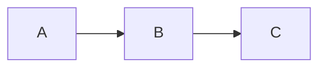
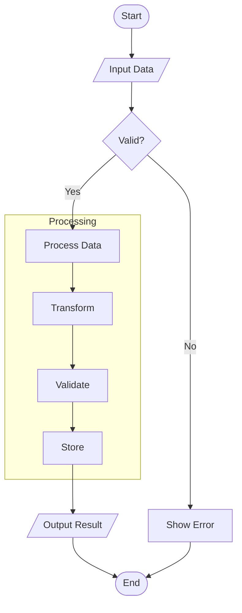
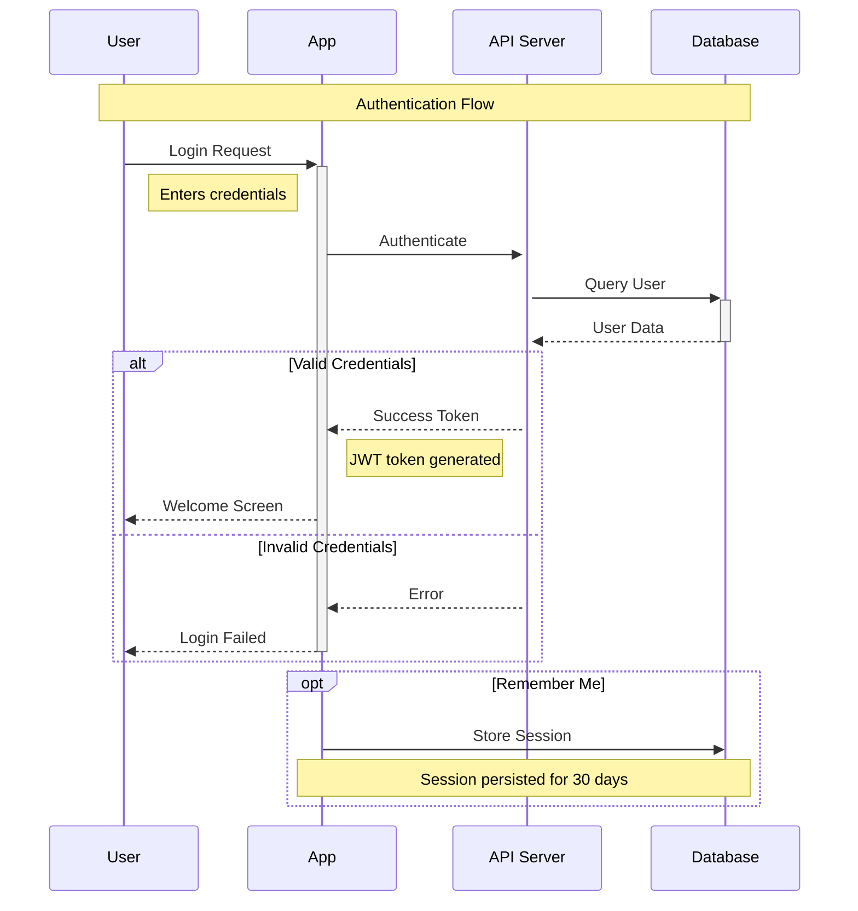
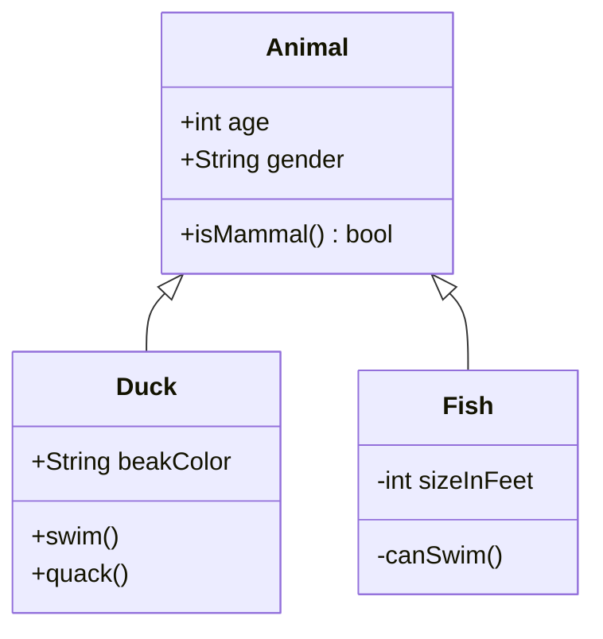
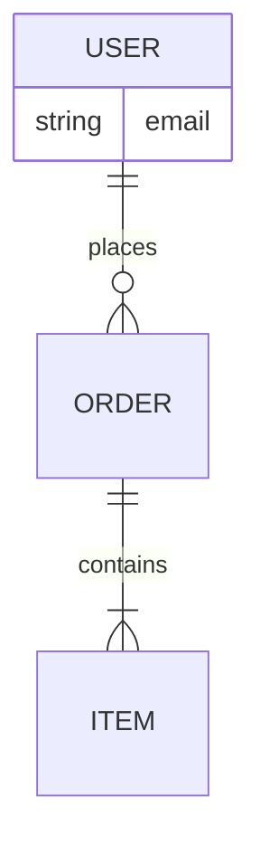
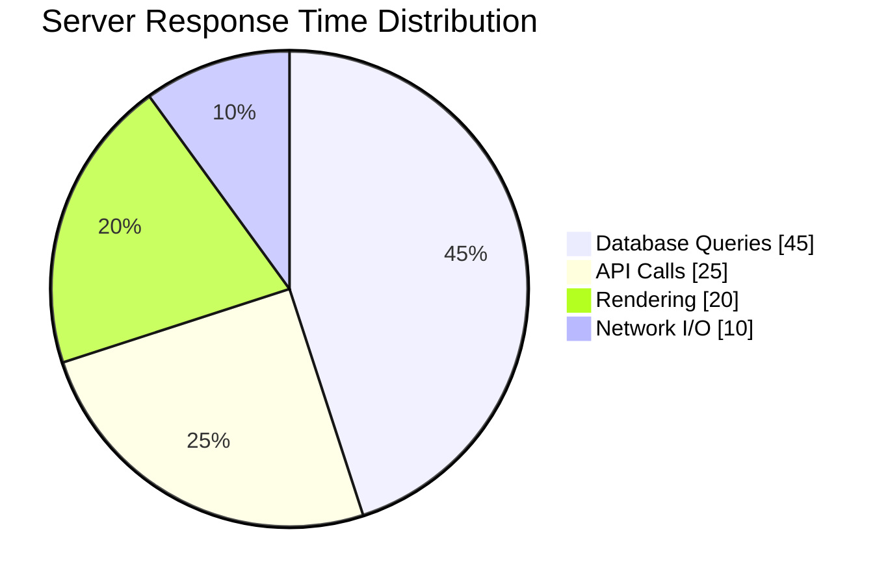
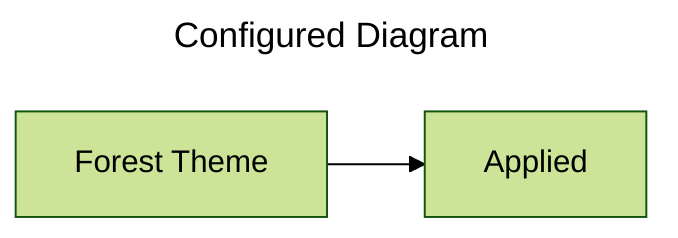

# Diagrams (Using Mermaid)

[1. Basic Syntax](#1-basic-syntax)    
[2. Flowcharts (Graphs)](#2-flowcharts-graphs)     
[3. Sequence Diagrams](#3-sequence-diagrams)     
[4. Class Diagrams (UML)](#4-class-diagrams-uml)     
[5. Entity Relationship (ER) Diagrams](#5-entity-relationship-er-diagrams)   
[6. Pie Charts](#6-pie-charts)     
[7. Configuration (Frontmatter)](#7-configuration-frontmatter)     

---

### 1. Basic Syntax

Diagrams are created using code blocks marked with the `mermaid` language identifier. 

**Syntax:**
````markdown
```mermaid
[Diagram Type]
    [Definitions]
```
````

| Diagram Type        | Diagram Identifier  |
| ------------------- | ------------------- |
| Flowchart           | `graph`/`flowchart` |
| Sequence            | `sequenceDiagram`   |
| Class               | `classDiagram`      |
| Entity Relationship | `erDiagram`         |
| Pie Chart           | `pie`               |

**Example:**
````markdown

````

**Rendered:**


---

### 2. Flowcharts (Graphs)

Visualizes logic flows and processes. Defined using `graph` (or `flowchart`) followed by the direction.

**Node Shapes:**
| Syntax     | Shape         |
| ---------- | ------------- |
| `[Text]`   | Rectangle     |
| `(Text)`   | Round edges   |
| `([Text])` | Stadium       |
| `((Text))` | Circle        |
| `{Text}`   | Rhombus       |
| `[/Text/]` | Parallelogram |

**Directions:**
| Code | Direction    |
| ---- | ------------ |
| `TD` | Top → Down   |
| `BT` | Bottom → Top |
| `LR` | Left → Right |
| `RL` | Right → Left |

**Arrows:**
| Syntax        | Shape               |
| ------------- | ------------------- |
| `---`         | Solid link          |
| `-->`         | Solid arrow         |
| `---\|text\|` | Link with label     |
| `-->\|text\|` | Arrow with label    |
| `-.->`        | Dotted arrow        |
| `<-->`        | Bidirectional arrow |

**Subgraphs:**
Group related nodes together using `subgraph [title] ... end` syntax.

**Example:**
````markdown

````

**Rendered:**


---

### 3. Sequence Diagrams

Visualizes interaction between participants over time. Defined using the `sequenceDiagram` keyword.

**Arrows:**
| Syntax | Shape                     |
| ------ | ------------------------- |
| `->`   | Solid line (Sync)         |
| `-->`  | Dotted line (Response)    |
| `->>`  | Solid arrow (Async)       |
| `-->>` | Dotted arrow (Async Resp) |
| `->>+` | Arrow (Activate Receiver) |
| `->>-` | Arrow (Deactivate Sender) |

**Logic:**
| Type        | Syntax                         | Description           |
| ----------- | ------------------------------ | --------------------- |
| Loop        | `loop [Title] ... end`         | Repetitive action     |
| Alternative | `alt [Title] ... else ... end` | If / Else conditional |
| Optional    | `opt [Title] ... end`          | If (without else)     |

**Notes:**
| Syntax                              | Position       |
| ----------------------------------- | -------------- |
| `Note right of [participant]: text` | Right side     |
| `Note left of [participant]: text`  | Left side      |
| `Note over [participant]: text`     | Above/spanning |
| `Note over [A],[B]: text`           | Spanning A & B |

**Example:**
````markdown

````

**Rendered:**


---

### 4. Class Diagrams (UML)

Models the structure of a system by showing classes, attributes, methods, and relationships. Defined using the `classDiagram` keyword.

**Relationships:**
| Syntax  | Relationship |
| ------- | ------------ |
| `<\|--` | Inheritance  |
| `*--`   | Composition  |
| `o--`   | Aggregation  |
| `-->`   | Association  |
| `--`    | Link (Solid) |
| `..\|>` | Realization  |

**Visibility:**
| Symbol | Meaning   |
| ------ | --------- |
| `+`    | Public    |
| `-`    | Private   |
| `#`    | Protected |
| `~`    | Package   |

**Example:**
````markdown

````

**Rendered:**


---

### 5. Entity Relationship (ER) Diagrams

Visualizes relational structures and how entities relate to one another. Defined using the `erDiagram` keyword.

**Cardinality:**
| Left   | Right  | Meaning      |
| ------ | ------ | ------------ |
| `\|o`  | `o\|`  | Zero or one  |
| `\|\|` | `\|\|` | Exactly one  |
| `}o`   | `o{`   | Zero or more |
| `}\|`  | `\|{`  | One or more  |

**Example:**
````markdown

````

**Rendered:**


---

### 6. Pie Charts

Visualizes proportional data. Defined using `pie` followed by an optional title.

**Example:**
````markdown

````

**Rendered:**


---

### 7. Configuration (Frontmatter)

Global diagram settings are configured using a YAML block at the very start of the code.

**Common Configurations:**
| Key      | Description                           |
| -------- | ------------------------------------- |
| `title`  | Sets a visible title for the diagram. |
| `config` | Nested object for theme settings      |

**Example:**
````markdown

````

**Rendered:**
