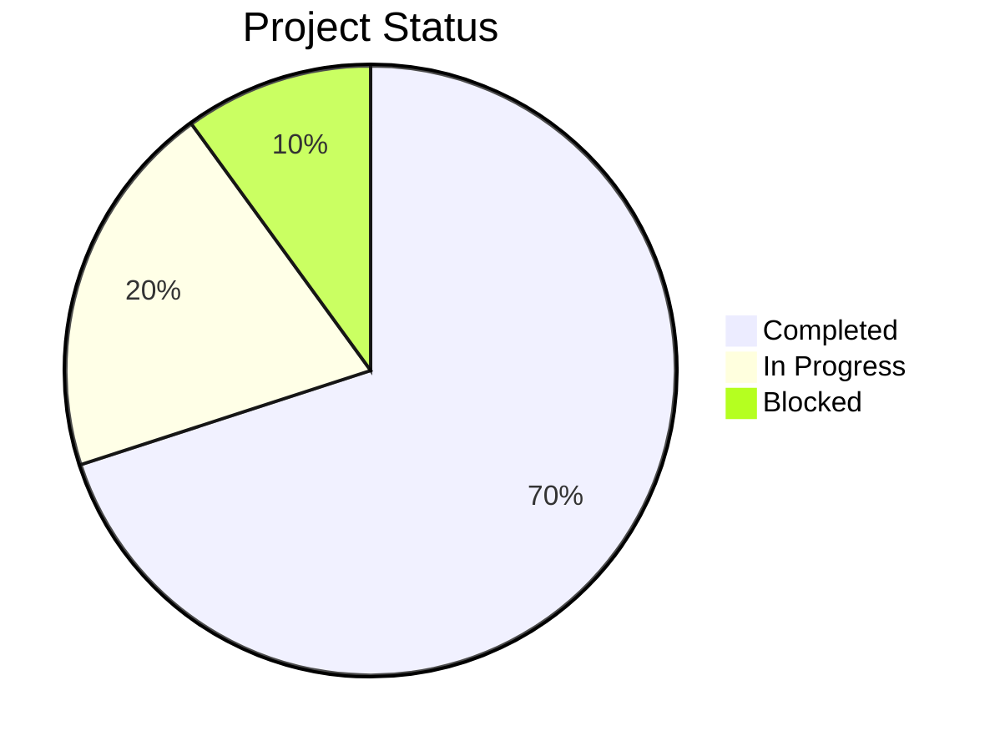

# Diagrams (Using Mermaid)

[1. Flowcharts (Graphs)](#1-flowcharts-graphs)     
[2. Sequence Diagrams](#2-sequence-diagrams)     
[3. Pie Charts](#3-pie-charts)     
[4. Entity Relationship (ER) Diagram](#4-entity-relationship-er-diagrams)   

---

### 3. Pie Charts

Simple percentage visuals for showing proportional data. Pie charts start with `pie` followed by an optional title.

**Example:**
````markdown

````

**Rendered:**


---