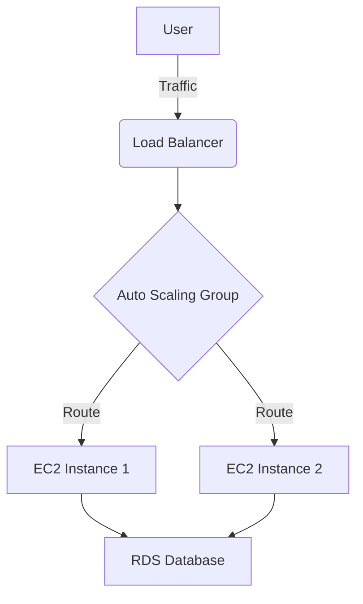

# Markdown

A comprehensive guide to the most commonly used Markdown syntax.

---

## Table of Contents

[Headers](#headers)  
[Text Formatting](#text-formatting)   
[Lists](#lists)   
[Blockquotes](#blockquotes)   
[Horizontal Line](#horizontal-line)    
[Code](#code)   
[Links](#links)   
[Images](#images)   
[Tables](#tables)   
[Escaping Characters](#escaping-characters)   
[Footnotes](#footnotes)   
[Using LaTeX (Math)](#using-latex-math)   
[Using HTML (Comments)](#using-html-comments)   
[Diagrams (Mermaid)](#diagrams-mermaid)    
[Diff Syntax (Code Changes)](#diff-syntax-code-changes)  
[Github Alerts (Admonitions)](#github-alerts-admonitions)  

---

## Headers

Use the hash symbol (`#`) to create up to six levels of headers.

```markdown
# Header 1
## Header 2
### Header 3
#### Header 4
##### Header 5
###### Header 6
```

# Header 1
## Header 2
### Header 3
#### Header 4
##### Header 5
###### Header 6

---

## Text Formatting

Text can be bold, italic, or have a strikethrough.

```markdown
**Bold text** or __Bold text__
*Italic text* or _Italic Text_
~~Strikethrough Text~~
***Bold and Italic***
```

**Bold text** or __Bold text__   
*Italic text* or _Italic Text_    
~~Strikethrough Text~~    
***Bold and Italic***    

---

## Lists

Lists can be ordered, unordered, or task-based.

```markdown
Use asterisks (`*`), plus signs (`+`), or hyphens (`-`) to create ordered lists.
* Item 1
+ Item 2
  - Nested item 2a
  * Nested item 2b
+ Item 3

Use numbers followed by a period to create ordered lists.
1. Item 1
2. Item 2
3. Item 3
   1. Nested item 3a  
   2. Nested item 3b

Use `-[ ]` to create a checkbox. Add an `x` inside to mark a task as complete.
- [x] Completed task
- [ ] Incomplete task
```

Use asterisks (`*`), plus signs (`+`), or hyphens (`-`) to create ordered lists.
* Item 1
+ Item 2
  - Nested item 2a
  * Nested item 2b
+ Item 3

Use numbers followed by a period to create ordered lists.
1. Item 1
2. Item 2
3. Item 3
   1. Nested item 3a  
   2. Nested item 3b

Use `-[ ]` to create a checkbox. Add an `x` inside to mark a task as complete.
- [x] Completed task
- [ ] Incomplete task

---

## Blockquotes

Use the greater-than symbol (`>`) to create blockquotes for quoted text.

```markdown
> This is a blockquote.
>
> > This is a nested blockquote.
```

> This is a blockquote.
>
> > This is a nested blockquote.

---

## Horizontal Rule

Use three or more asterisks (`***`), dashes (`---`), or underscores (`___`) to create a thematic break.

```markdown
***
---
___
```

***
---
___

## Code

Use single backticks (`` `...` ``) for inline code, or triple backticks (` ``` `) for fenced code blocks. To enable syntax highlighting in a fenced code block, specify the language name after the opening backticks.

````markdown
This is `inline code`.

```python
# This is a fenced code block with Python syntax highlighting.
def hello():
  print("Hello, world!")
```
````

This is `inline code`.

```python
# This is a fenced code block with Python syntax highlighting.
def hello():
  print("Hello, world!")
```

---

## Links

Hyperlinks can be inline, reference-style, internal, or relative.

```markdown
This is an inline link to [NASA](https://www.nasa.gov "Visit NASA") with an optional hover title.   

This is a reference-style link to [HubbleSite][hubble].  

[hubble]: https://hubblesite.org "Explore the Hubble Space Telescope"

This is an internal link to the [Images section](#images). 

[Link to a file in the same directory](./notes.md)
[Link to a file in a subdirectory](./docs/contributing.md)
[Link to a file in a parent directory](../README.md)
```

This is an inline link to [NASA](https://www.nasa.gov "Visit NASA") with an optional hover title.   

This is a reference-style link to [HubbleSite][hubble].  

[hubble]: https://hubblesite.org "Explore the Hubble Space Telescope"

This is an internal link to the [Images section](#images). 

[Link to a file in the same directory](./notes.md)   
[Link to a file in a subdirectory](./docs/contributing.md)   
[Link to a file in a parent directory](../README.md)   

---

## Images

The syntax to embed images is similar to links, but prefixed with an exclamation mark (`!`).

```markdown
This is an inline image URL with an optional hover title.    


This is a reference-style image with the URL defined elsewhere in the document.   
![Reference placeholder][img-ref]

[img-ref]: https://placehold.co/400x200/EEE/31343C?text=Reference+Image "Reference Placeholder"
```
 
This is an inline image URL with an optional hover title.    


This is a reference-style image with the URL defined elsewhere in the document.   
![Reference placeholder][img-ref]

[img-ref]: https://placehold.co/400x200/EEE/31343C?text=Reference+Image "Reference Placeholder"

---

## Tables

Create tables using pipes (`|`) for columns and hyphens (`-`) for the header row. Use colons (`:`) to set column alignment.

```markdown
| Left-Aligned | Center-Aligned | Right-Aligned |
| :----------- | :------------: | ------------: |
| Cell 1       |     Cell 2     |        Cell 3 |
| Cell 4       |     Cell 5     |        Cell 6 |
```

| Left-Aligned | Center-Aligned | Right-Aligned |
| :----------- | :------------: | ------------: |
| Cell 1       |     Cell 2     |        Cell 3 |
| Cell 4       |     Cell 5     |        Cell 6 |

---

## Escaping Characters

Use a backslash (`\`) to display special Markdown characters literally.

```markdown
\*This is not italic.\*
```

\*This is not italic.\*

---

## Footnotes

Create footnotes using `[^n]` for the reference and `[^n]:` for the definition. 

```markdown
Here is a statement with a footnote.[^1]

[^1]: This is the footnote text.
```

Here is a statement with a footnote.[^1]

[^1]: This is the footnote text.

---

## Using LaTeX (Math)

Use LaTeX for advanced mathematical expressions. Wrap equations in single dollar signs (`$...$`) for inline math and double dollar signs (`$$...$$`) for display math.

```markdown
This is inline math: $a^2 + b^2 = c^2$

This is display math:    
$$x = \frac{-b \pm \sqrt{b^2 - 4ac}}{2a}$$
```

This is inline math: $a^2 + b^2 = c^2$

This is display math:    
$$x = \frac{-b \pm \sqrt{b^2 - 4ac}}{2a}$$

---

## Using HTML (Comments)

Use raw HTML for features Markdown doesn't support, like comments and collapsible sections.

```html
<!-- This is a comment -->

<details>
  <summary>Click to expand!</summary>
  
  This content is hidden by default but is revealed when you click the summary text.
  You can even include **Markdown** `inside` HTML.
</details>
```

<details>
  <summary>Click to expand!</summary>
  
  This content is hidden by default but is revealed when you click the summary text.
  You can even include **Markdown** `inside` HTML.
</details>

Use the HTML `<kbd>` tag to render text as keyboard keys. This is excellent for writing technical tutorials or shortcuts.

```
To copy, press <kbd>Ctrl</kbd> + <kbd>C</kbd>.

To save, press <kbd>Cmd</kbd> + <kbd>S</kbd>.
```

To copy, press <kbd>Ctrl</kbd> + <kbd>C</kbd>.

To save, press <kbd>Cmd</kbd> + <kbd>S</kbd>.

---

## Diagrams (Mermaid)

GitHub supports Mermaid.js for rendering diagrams and flowcharts directly in markdown. This is essential for documenting cloud architecture and logic flows.

````markdown

````


---

## Diff Syntax (Code Changes)

Use the diff language identifier to show added or removed lines. This is standard for documenting changes or pull requests.

````markdown
```diff
  def hello_world():
-     print("Hello")
+     print("Hello, World!")
```
````

```diff
  def hello_world():
-     print("Hello")
+     print("Hello, World!")
```

---

## GitHub Alerts (Admonitions)

Use these special blockquote headers to create colored callout boxes on GitHub. This is standard for highlighting warnings, tips, or important notes in documentation.

```
> [!NOTE]
> Useful information that users should know, even when skimming.

> [!TIP]
> Helpful advice for doing things better or faster.

> [!IMPORTANT]
> Key information users need to know to achieve their goal.

> [!WARNING]
> Urgent info that needs immediate user attention to avoid problems.

> [!CAUTION]
> Advises about risks or negative outcomes of certain actions.
```

> [!NOTE]
> Useful information that users should know, even when skimming.

> [!TIP]
> Helpful advice for doing things better or faster.

> [!IMPORTANT]
> Key information users need to know to achieve their goal.

> [!WARNING]
> Urgent info that needs immediate user attention to avoid problems.

> [!CAUTION]
> Advises about risks or negative outcomes of certain actions.

---
